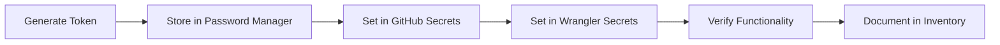

# ORBIT Secrets Management

Comprehensive guide for managing secrets in the ORBIT Self-Healing Agent system.

## Table of Contents

1. [Overview](#overview)
2. [Secret Types](#secret-types)
3. [Storage Locations](#storage-locations)
4. [Secret Lifecycle](#secret-lifecycle)
5. [Access Control](#access-control)
6. [Rotation Procedures](#rotation-procedures)
7. [Security Monitoring](#security-monitoring)
8. [Emergency Procedures](#emergency-procedures)

## Overview

ORBIT requires multiple secrets to function across GitHub Actions and Cloudflare Workers. This document covers best practices for managing these secrets securely.

### Security Principles

1. **Least Privilege**: Secrets have minimum necessary permissions
2. **Separation of Concerns**: Different secrets for different services
3. **Regular Rotation**: Secrets rotated on schedule
4. **Audit Trail**: All secret access is logged
5. **Encryption at Rest**: All secrets encrypted in storage

## Secret Types

### 1. GitHub Personal Access Token (ORBIT_GITHUB_TOKEN)

**Purpose**: Allows ORBIT to interact with GitHub API

**Required Scopes**:
- `repo`: Full repository access (read/write)
- `workflow`: Trigger and manage GitHub Actions workflows

**Format**: `ghp_` followed by 36+ alphanumeric characters

**Creation Steps**:
1. Go to https://github.com/settings/tokens/new
2. Set note: "ORBIT Self-Healing Agent"
3. Set expiration: 90 days (recommended)
4. Select scopes: `repo`, `workflow`
5. Click "Generate token"
6. **Copy immediately** (won't be shown again)

**Security Considerations**:
- Can read/write all repository content
- Can trigger workflows (resource consumption)
- Should be rotated every 90 days
- Never commit to repository
- Revoke immediately if compromised

### 2. Telegram Bot Token (TELEGRAM_BOT_TOKEN)

**Purpose**: Authenticates ORBIT's Telegram bot

**Format**: `<bot-id>:<secret>` (e.g., `123456789:ABCdefGHIjklMNOpqrsTUVwxyz1234567`)

**Creation Steps**:
1. Open Telegram and search for [@BotFather](https://t.me/BotFather)
2. Send `/newbot` command
3. Choose display name (e.g., "ORBIT BSM Bot")
4. Choose username (must end in `bot`)
5. Copy token provided by BotFather

**Security Considerations**:
- Anyone with token can control bot
- Cannot access Telegram account data
- Can only receive messages sent to bot
- Revoke by creating new bot if compromised
- Store securely, never commit

### 3. Telegram Admin Chat IDs (ORBIT_ADMIN_CHAT_IDS)

**Purpose**: Restricts ORBIT commands to authorized users

**Format**: Comma-separated numeric chat IDs (e.g., `123456789,987654321`)

**How to Get**:
```bash
./scripts/get-telegram-chat-id.sh
```

**Security Considerations**:
- Only listed IDs can control ORBIT
- Unauthorized users receive "Access Denied" message
- Can add multiple admins
- Review and update regularly
- Remove former team members promptly

### 4. Cloudflare Account ID (CF_ACCOUNT_ID)

**Purpose**: Identifies your Cloudflare account for Workers deployment

**Format**: 32 hexadecimal characters

**Location**: Cloudflare Dashboard → Workers & Pages → Overview

**Security Considerations**:
- Not highly sensitive (public in Workers URL)
- Required for deployment only
- Cannot be used to access account
- No rotation needed

### 5. Cloudflare Zone ID (CF_ZONE_ID)

**Purpose**: Identifies your domain zone for Workers routing

**Format**: 32 hexadecimal characters

**Location**: Cloudflare Dashboard → Your Domain → Overview → API section

**Security Considerations**:
- Similar to Account ID (low sensitivity)
- Required for custom domain routing
- No rotation needed

### 6. Cloudflare Project Name (CF_PROJECT_NAME)

**Purpose**: Names your Workers project

**Format**: Alphanumeric string (e.g., `orbit-workers`)

**Security Considerations**:
- Not a secret (appears in URLs)
- Choose descriptive, non-sensitive name
- Avoid including "production", "staging" in name

## Storage Locations

### GitHub Secrets

**Location**: Repository Settings → Secrets and variables → Actions

**Access Method**:
```bash
# List secrets (names only, not values)
gh secret list --repo LexBANK/BSM

# Set a secret
echo "value" | gh secret set SECRET_NAME --repo LexBANK/BSM

# Delete a secret
gh secret delete SECRET_NAME --repo LexBANK/BSM
```

**Properties**:
- Encrypted at rest (AES-256)
- Masked in workflow logs
- Accessible only to workflows
- Cannot be read via API (write-only)

### Cloudflare Workers Secrets

**Location**: Cloudflare Dashboard → Workers & Pages → Your Worker → Settings → Variables

**Access Method**:
```bash
# List secrets (names only)
wrangler secret list --env production

# Set a secret
echo "value" | wrangler secret put SECRET_NAME --env production

# Delete a secret
wrangler secret delete SECRET_NAME --env production
```

**Properties**:
- Encrypted at rest
- Accessible at runtime via `env` object
- Scoped per environment (production, staging, etc.)
- Cannot be read after setting

### Local Development

**⚠️ NEVER store production secrets in local files**

For local development, use `.env.local` (gitignored):

```bash
# .env.local (DO NOT COMMIT)
TELEGRAM_BOT_TOKEN=your-dev-bot-token
ORBIT_GITHUB_TOKEN=your-dev-token
ORBIT_ADMIN_CHAT_IDS=your-chat-id
```

Always use a separate development bot and token.

## Secret Lifecycle

### 1. Creation



### 2. Active Use

- Monitored via Cloudflare logs
- Checked for unauthorized access
- Validated periodically
- Included in security audits

### 3. Rotation

**Schedule**: Every 90 days (recommended)

**Process**:
1. Generate new token
2. Test in staging environment
3. Update GitHub Secrets
4. Update Wrangler Secrets
5. Verify ORBIT functionality
6. Revoke old token
7. Update documentation

### 4. Revocation

**When to Revoke**:
- Suspected compromise
- Token leaked in logs/code
- Team member departure
- Scheduled rotation
- Security incident

**How to Revoke**:
```bash
# GitHub token
# 1. Go to https://github.com/settings/tokens
# 2. Find token by note ("ORBIT Self-Healing Agent")
# 3. Click "Delete"

# Telegram bot token
# 1. Message @BotFather on Telegram
# 2. Send: /revoke
# 3. Select your bot
# 4. Confirm revocation
```

## Access Control

### Who Has Access

| Secret | GitHub Admins | Workflow Runners | Cloudflare Workers | Developers |
|--------|---------------|------------------|-------------------|------------|
| ORBIT_GITHUB_TOKEN | Set/Delete | Read | Read | No Access |
| TELEGRAM_BOT_TOKEN | Set/Delete | Read | Read | No Access |
| ORBIT_ADMIN_CHAT_IDS | Set/Delete | Read | Read | View Only |
| CF_ACCOUNT_ID | Set/Delete | Read | Read | View Only |
| CF_ZONE_ID | Set/Delete | Read | Read | View Only |

### Permission Model

**GitHub Repository**:
- Admin role required to set/delete secrets
- Workflows can read secrets via `secrets.SECRET_NAME`
- Pull requests from forks cannot access secrets

**Cloudflare Workers**:
- Account member role required
- Workers read secrets at runtime via `env.SECRET_NAME`
- No API access to read secret values

### Audit Logging

**GitHub**:
- Audit log: Repository Settings → Audit log
- Filter by "secret" events
- Shows: Who, What, When

**Cloudflare**:
- Audit log: Dashboard → Audit Log
- Filter by "secret" events
- Retention: 90 days

## Rotation Procedures

### GitHub Token Rotation

```bash
# 1. Generate new token at https://github.com/settings/tokens/new
# 2. Update GitHub Secret
echo "ghp_newtoken123..." | gh secret set ORBIT_GITHUB_TOKEN --repo LexBANK/BSM

# 3. Update Wrangler Secret
echo "ghp_newtoken123..." | wrangler secret put ORBIT_GITHUB_TOKEN --env production

# 4. Test ORBIT functionality
# Send /status to bot on Telegram

# 5. Revoke old token at https://github.com/settings/tokens
```

### Telegram Bot Token Rotation

**⚠️ Warning**: Rotating bot token changes bot identity

**Alternative**: Create new bot and migrate

```bash
# 1. Create new bot with @BotFather
# 2. Update secrets with new token
echo "123456:newtoken..." | gh secret set TELEGRAM_BOT_TOKEN --repo LexBANK/BSM
echo "123456:newtoken..." | wrangler secret put TELEGRAM_BOT_TOKEN --env production

# 3. Update webhook URL
curl -X POST "https://api.telegram.org/bot<NEW_TOKEN>/setWebhook" \
  -H "Content-Type: application/json" \
  -d '{"url": "https://your-worker.workers.dev"}'

# 4. Revoke old bot with @BotFather
```

### Admin Chat IDs Update

```bash
# Add new admin
# Get their chat ID first with get-telegram-chat-id.sh

# Update with comma-separated list
echo "123456789,987654321,111222333" | gh secret set ORBIT_ADMIN_CHAT_IDS --repo LexBANK/BSM
echo "123456789,987654321,111222333" | wrangler secret put ORBIT_ADMIN_CHAT_IDS --env production
```

## Security Monitoring

### Daily Checks

- Review Cloudflare Workers logs for anomalies
- Check GitHub Actions workflow runs
- Monitor Telegram bot activity

### Weekly Checks

- Review GitHub audit log for secret access
- Verify authorized admin list
- Check for failed authentication attempts

### Monthly Checks

- Test secret rotation procedure
- Review and update documentation
- Conduct security training

### Automated Monitoring

**GitHub Actions Workflow** (`.github/workflows/security-monitor.yml`):

```yaml
name: Security Monitor
on:
  schedule:
    - cron: '0 0 * * *'  # Daily at midnight

jobs:
  check-secrets:
    runs-on: ubuntu-latest
    steps:
      - name: Verify secrets exist
        run: |
          # Check that all required secrets are set
          # (Cannot read values, only verify existence)
```

### Alert Channels

1. **GitHub Security Alerts**: Email notifications
2. **Telegram Bot**: Send alerts to admin chat IDs
3. **Cloudflare Email**: Workers error notifications

## Emergency Procedures

### Suspected Token Leak

**Immediate Actions** (within 5 minutes):

1. **Revoke compromised token**
   ```bash
   # GitHub: https://github.com/settings/tokens
   # Telegram: @BotFather → /revoke
   ```

2. **Generate new token**
3. **Update all secrets**
4. **Review recent activity**
5. **Document incident**

### Unauthorized Access

**Response Checklist**:

- [ ] Identify compromised secret
- [ ] Revoke immediately
- [ ] Generate replacement
- [ ] Update GitHub Secrets
- [ ] Update Wrangler Secrets
- [ ] Review audit logs
- [ ] Verify no malicious actions
- [ ] Update access control
- [ ] Document incident
- [ ] Report to security team

### Data Breach

**If secrets exposed in repository**:

1. **Stop all workflows**: Disable Actions in repository settings
2. **Revoke all secrets immediately**
3. **Remove exposed secrets from git history**:
   ```bash
   # Use BFG Repo-Cleaner or git-filter-repo
   git filter-repo --invert-paths --path secrets.txt
   ```
4. **Force push cleaned history** (requires coordination)
5. **Regenerate all tokens**
6. **Update all secrets**
7. **Re-enable workflows**
8. **Monitor for 48 hours**

## Best Practices Checklist

- [ ] All secrets stored in GitHub Secrets/Wrangler
- [ ] No secrets in code or configuration files
- [ ] `.gitignore` includes `.env.local`, `*.secret`
- [ ] Tokens have minimum required scopes
- [ ] GitHub token expires in 90 days
- [ ] Admin chat IDs regularly reviewed
- [ ] Audit logs checked weekly
- [ ] Rotation procedure tested monthly
- [ ] Emergency contacts documented
- [ ] Incident response plan ready

## Tools and Resources

### Password Managers

Recommended for storing backup copies:
- 1Password
- Bitwarden
- LastPass

### Secret Scanning

Tools to detect leaked secrets:
- [Gitleaks](https://github.com/gitleaks/gitleaks)
- [TruffleHog](https://github.com/trufflesecurity/truffleHog)
- GitHub Secret Scanning (automatic)

### Monitoring Services

- [Cloudflare Analytics](https://dash.cloudflare.com/)
- [GitHub Actions Usage](https://github.com/settings/billing)
- [Sentry](https://sentry.io/) (optional error tracking)

## Compliance and Auditing

### Compliance Requirements

- SOC 2 Type II (if applicable)
- GDPR (for EU users)
- ISO 27001 (information security)

### Audit Trail Requirements

**Retained for 1 year minimum**:
- Secret creation/update/deletion events
- Access attempts (successful and failed)
- Rotation history
- Incident reports

### Regular Audits

**Quarterly Review**:
- Verify all secrets still needed
- Confirm authorized users list
- Test rotation procedures
- Review access logs
- Update documentation

## FAQ

**Q: Can I share secrets between environments?**  
A: No. Use separate tokens for production, staging, and development.

**Q: How do I back up secrets?**  
A: Store in a password manager. Never store in plaintext files.

**Q: What if I lose access to Telegram admin account?**  
A: Update `ORBIT_ADMIN_CHAT_IDS` with new chat ID using GitHub CLI.

**Q: Can workflows read secret values?**  
A: Yes, but values are masked in logs. Use `${{ secrets.NAME }}`.

**Q: How long do GitHub tokens last?**  
A: Set expiration (7, 30, 60, 90 days, or no expiration). Recommend 90 days.

**Q: What happens if webhook URL changes?**  
A: Update webhook with Telegram API. No secret changes needed.

---

**Last Updated**: 2026-02-06  
**Version**: 1.0.0  
**Maintained By**: LexBANK/BSM Security Team
